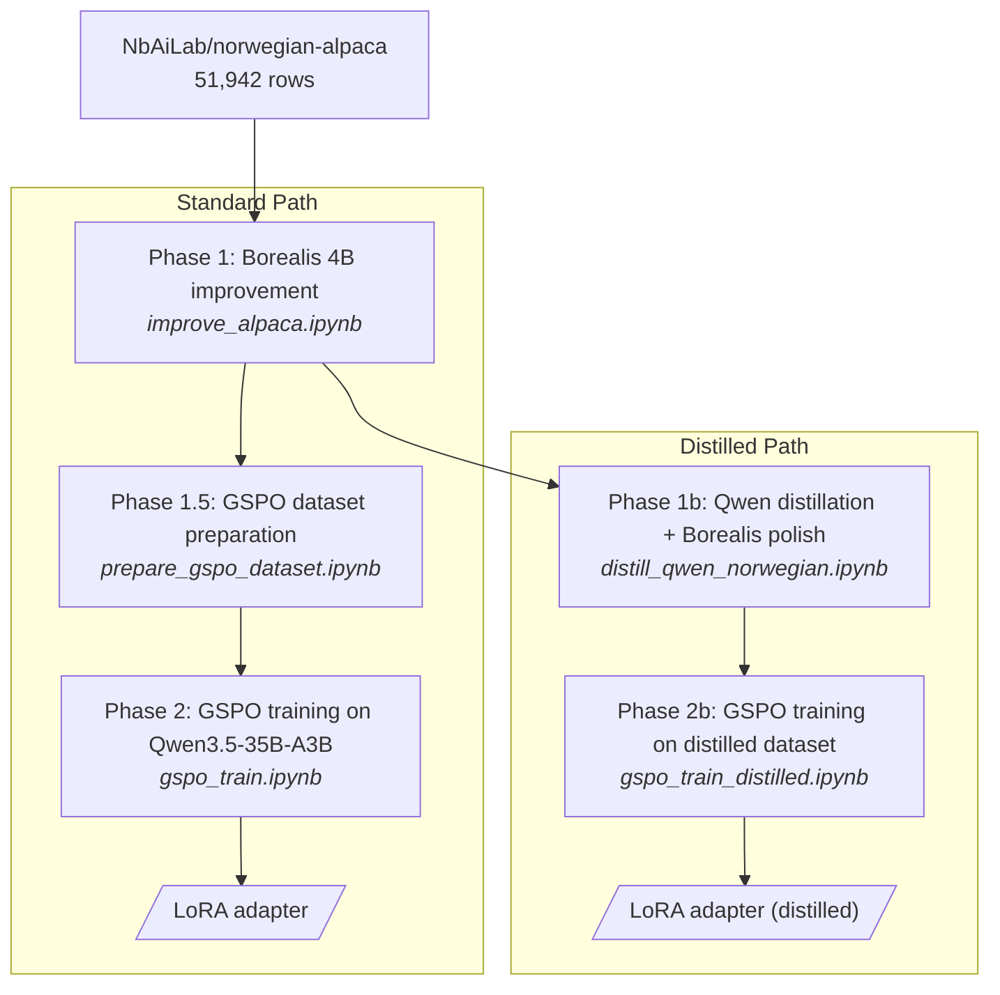

# NORAI-Tools

Norwegian AI dataset tools for improving and preparing Norwegian language datasets.

## Pipeline Architecture

NORAI-Tools implements a two-phase pipeline with two paths: a standard path using Borealis 4B, and a distilled path that adds Qwen distillation before Borealis polishing.



## Project Structure

```
norai_tools/                         # Python library
    __init__.py                      # All exports
    config.py                        # Constants (model name, batch size, etc.)
    improver.py                      # AlpacaImprover: batch improvement engine
    loader.py                        # Dataset I/O + checkpointing
    prompts.py                       # Norwegian improvement prompt template
    validation.py                    # Response validation (preamble strip, hallucination check)
    gspo_prep.py                     # GSPO dataset preparation (prompt format, task classification)
    rewards.py                       # 4 reward functions for GSPO training

notebooks/                           # Jupyter notebooks (thin wrappers around library)
    improve_alpaca.ipynb             # Phase 1: Borealis improvement
    prepare_gspo_dataset.ipynb       # Phase 1.5: GSPO dataset prep
    gspo_train.ipynb                 # Phase 2: GSPO alignment training
    distill_qwen_norwegian.ipynb     # Phase 1b: Qwen distillation + Borealis polish
    gspo_train_distilled.ipynb       # Phase 2b: GSPO on distilled dataset

modal_app.py                         # Modal.com CLI runner for cloud GPU execution
GenerateDatasetsAndTrainingPlan.md   # Full pipeline runbook for Modal
tests/                               # 110 tests
pyproject.toml                       # Package config
```

## Installation

Requires Python 3.10+. Uses [uv](https://docs.astral.sh/uv/) for fast dependency management.

```bash
# Install uv (if not already installed)
curl -LsSf https://astral.sh/uv/install.sh | sh

# Clone and sync
git clone https://github.com/your-username/NORAI-Tools.git
cd NORAI-Tools
uv sync                    # Core deps (improvement pipeline)
uv sync --extra dev        # + test deps
uv sync --extra modal      # + Modal cloud runner
uv sync --extra gspo       # + GSPO training (TRL, vLLM, etc.) — requires CUDA
```

<details>
<summary>Using pip instead of uv</summary>

```bash
pip install -e .
pip install -e ".[gspo]"    # GSPO training deps
pip install -e ".[modal]"   # Modal cloud runner
pip install -e ".[dev]"     # Test deps
```

</details>

## Quick Start

### Notebooks

Open any notebook under `notebooks/` and run cells in order. Each notebook is a thin wrapper around the `norai_tools` library.

### Modal CLI

Run pipeline steps on [Modal](https://modal.com) cloud GPUs. No local GPU required.

```bash
# One-time setup
uv sync --extra modal
modal token new

# Optional: add HuggingFace token for Hub push
modal secret create huggingface HF_TOKEN=hf_your_token_here
```

Available steps:

| Command | Phase | GPU | Time |
|---|---|---|---|
| `modal run modal_app.py --step improve` | 1: Borealis improvement | L4 | ~12h |
| `modal run modal_app.py --step prepare-gspo` | 1.5: GSPO dataset prep | CPU | ~1min |
| `modal run modal_app.py --step distill-generate` | 1b: Qwen generation | A100-80GB | ~15h |
| `modal run modal_app.py --step distill-polish` | 1b: Borealis polish | L4 | ~10h |
| `modal run modal_app.py --step gspo-train` | 2: GSPO training | 2x A100-80GB | 24-72h |
| `modal run modal_app.py --step gspo-train-distilled` | 2b: GSPO distilled | 2x A100-80GB | 24-72h |
| `modal run modal_app.py --step all` | Full standard pipeline | | |
| `modal run modal_app.py --step all-distilled` | Full distilled pipeline | | |

Test on a small subset first:

```bash
modal run modal_app.py --step improve --subset 100
```

Datasets persist on Modal Volumes (`norai-data`, `norai-models`) across runs. All steps support checkpoint-based resumption if interrupted.

See [GenerateDatasetsAndTrainingPlan.md](GenerateDatasetsAndTrainingPlan.md) for the full runbook with cost estimates, volume management, and CLI options.

### Tests

```bash
uv run pytest tests/ -v
```

## Library API

| Export | Module | Description |
|---|---|---|
| `AlpacaImprover` | `improver` | Batch improvement engine using Borealis 4B |
| `load_alpaca` | `loader` | Load the norwegian-alpaca dataset from HuggingFace |
| `save_improved` | `loader` | Save improved dataset to Parquet with checkpointing |
| `prepare_gspo_dataset` | `gspo_prep` | Convert improved dataset to GSPO prompt format |
| `validate_gspo_dataset` | `gspo_prep` | Validate a prepared GSPO dataset |
| `classify_task_type` | `gspo_prep` | Classify instruction into task type |
| `semantic_reward` | `rewards` | Cosine similarity to reference (multilingual-e5-large) |
| `language_reward` | `rewards` | Norwegian language quality score |
| `length_reward` | `rewards` | Length appropriateness relative to reference |
| `accuracy_reward` | `rewards` | Factual accuracy score |
| `build_improvement_prompt` | `prompts` | Build the Borealis improvement prompt |
| `validate_response` | `validation` | Strip preamble and check for hallucination |

## Models Used

| Model | Role |
|---|---|
| [NbAiLab/borealis-4b-instruct-preview](https://huggingface.co/NbAiLab/borealis-4b-instruct-preview) | Phase 1 -- Norwegian text improvement (Gemma 3 4B fine-tune) |
| [Qwen/Qwen3.5-35B-A3B](https://huggingface.co/Qwen/Qwen3.5-35B-A3B) | Phase 2 -- GSPO alignment target (MoE, instruct) |

## Dataset

[NbAiLab/norwegian-alpaca](https://huggingface.co/datasets/NbAiLab/norwegian-alpaca) -- 51,942 rows with 3 Norwegian columns (`instruction`, `input`, `output`) and 3 English columns (`instruction_en`, `input_en`, `output_en`).

## License

MIT
